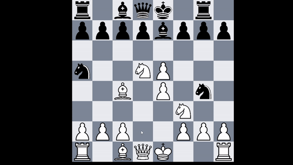

# ChessAI

  

  The game utilizes pygame for the interface with a multitude of classes in order to create a structure for the dragger, 
  updating piece locations, as well as piece dragging motion and animations. The class hierchy is as follows: main.py which includes board.py and game.py, board.py includes square.py, and game.py includes dragger.py. Board and square.py act as the "backend" of the game, which holds data throughout the board as well as data tranfers from one place on the board to another. This is done firstly through Board.py where the 8x8 board is initialized through the initialization of the board object in main, where each index of the Board is a square object from square.py. Each square object then holds piece information including piece name, team, image url, and possible attackers towards the square (for the AI). This together acts with the "front-end" of the game, game.py and dragger.py which are both responsible for the drag and drop graphics and piece display, which is done by iterating through the data board and displaying each individual square one at a time with its corresponding square color through certain calculations. 

This is mainly done in game.py, where the board is iterated over again checking for information inside each square, displaying the piece through the image URL provided from square.py through the initialization of the board. To note, if a piece is moved to a valid square, all the data is transferred from the previous square to the new square, overwriting the current data on the new square while making the previous square empty, which is also how captures are done datawise. Since this utilizes pygame, in order for the game to run, everything is put under a while loop which creates the display, and in every iteration of the while loop, each square of the board is being drawn onto the display as well as the pieces, thus the dragging animation needs to overlap each iteration of the while loop. This is where the dragger comes into place to create the drag and drop graphics. The dragger works by utilizes pygame's mouse down and mouse button up functions and saving the piece location on the mouse while the mouse button is down. This is called in main, and the status of the mouse is saved on dragger, along with displaying the piece at the mouse location during the while loop while the mouse is down. When the mouse is let go, the position on the board is calculated and the data is then compared under board to see if the square on the baord is a valid move. If the square is not a valid move, the piece is sent back to the original square. This combination of the board, square, game, and dragger, together create the data transfers and graphics to make the chess game functionable and fun.  
  
  Now when it comes to the AI, its created through a depth first search function which looks through all the possible moves it can make at an outlook of three moves. It is a rule based AI, which assumes that any piece that can be attacked where the opponent will have a positive trade off, will have that piece captured. For example if a pond(1 point) can take a bishop(3 points), the AI assumes that the opponent will use that pond to capture the bishop. Thus, the AI plays hypothetical games at an outlook of three moves with these trade-offs, and then plays the move which will result in the highest net point gain, where the king is also worth 10000 points. However, since this also needs to be run under the while loop, it delays the next iteration finding the next move. Thus, I implement multi-threading so that this algorithm works to find the next move at the same time while the while loop runs to display the board and pieces without any delay or lag for the next iteration in the while loop so the game can run smoothly.

  This together makes my chess project!

Usage: 
git clone \<this-repo\>  
pip install --upgrade wheel  
pip install playsound  
run main.py  \*under the ChessAI folder\*  
